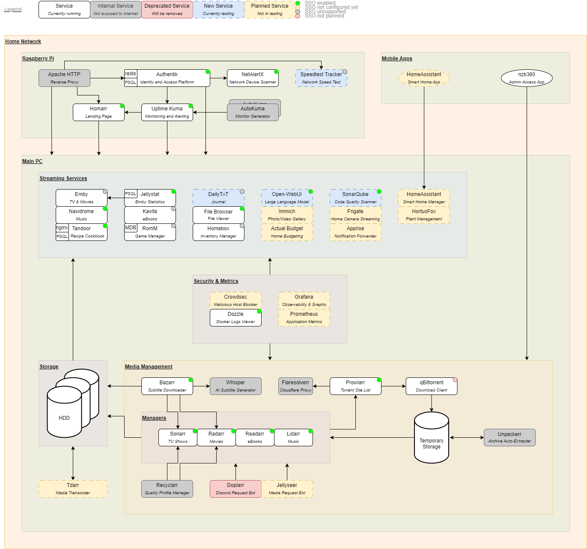

# Architecture Diagram



# !! Work In Progress Below !!

----

# Services

TODO: Decide the order of the subheadings within each service

##  Radarr

TODO: Purpose

### Docker Compose Extract

```
radarr:
  image: linuxserver/radarr:nightly-version-5.7.0.8851
  container_name: radarr
  hostname: radarr
  depends_on:
    qbittorrent:
        condition: service_healthy
  deploy:
    resources:
      limits:
        cpus: "1"
        memory: "1024M"
  environment:
    # Base config
    TZ: "${TIMEZONE:?Timezone not set}"
  healthcheck:
    interval: 30s
    retries: 3
    start_period: 30s
    test: "curl --silent --fail http://localhost:3000/ping | grep -q 'OK' || exit 1"
    timeout: 5s
      labels:
      # Uptime-Kuma monitor config
      kuma.{{container_name}}.http.name: "Radarr (Movie Manager)"
      kuma.{{container_name}}.http.url: "${RADARR_MONITOR_URL:?[radarr] Monitor URL missing}"
  networks:
    - home
  ports:
    - "4000:3000"
  restart: unless-stopped
  user: "${PUID_ROOT:?User ID missing}:${PGID_ROOT:?Group ID missing}"
  volumes:
    # Volume mounts from host system
    - "${DOWNLOADS_DIRECTORY}:/downloads"
    - "${MOVIE_DIRECTORY}:/movies"
    # Persistent volumes
    - ./storage/radarr/:/config
```

### Additional Environment Variables

None.

### Required Services

### Is It Mandatory

No.

Radarr is a companion to Sonarr/Lidarr/Readarr, but it is used to finding movies. If you have no need of _ever_ wanting movies to be downloaded
automatically, this service can be removed.

It is possible to search for content through Prowlarr directly if a movie is wanted. However, they may potentially need to be manually renamed/moved
after the download is completed.

### Healthcheck

Radarr exposes a healthcheck endpoint, **/ping**. We configure the h

### Ports

The default Radarr port of **7878** has been changed in the Radarr UI to **3000**. We then publicly expose it as port **4000**. This is minor
obfuscation, and should not be considered actual security.

### Volumes

##  Homarr

##  Sonarr

##  Lidarr

##  Readarr

----

# Misc/Common Info

## Common Healthcheck

TODO: Discuss interval/retries/start_period/timeout default values

## Common Environment Variables

Most services may contain the following environment variables:

| Environment Variable Name | Purpose  | Example Value    |
|---------------------------|----------|------------------|
| TZ (or TIMEZONE)          | Timezone | Pacific/Auckland |

Since they are used throughout, we set these values in the `.env` file and pass them in through our docker-compose configuration.

### PGID/PUID

The **PGID** and **PUID** are used to override the group and user ID of the running container process, for permissions and privileges. Most services
currently use the root user and group (**0**), exposed through the environment variables **PGID_ROOT** and **PUID_ROOT**. Some have been tested with
non-root users and will instead use **PGID_NON_ROOT** and **PUID_NON_ROOT**.

```
services:
  service_name:
    image: image_name:tag
  user: "${PUID_NON_ROOT}:${PGID_NON_ROOT}"
```

### TZ/TIMEZONE

**TZ** or **TIMEZONE** is used to tell the service the running host's timezone, as defined by
the [tz database](https://en.wikipedia.org/wiki/List_of_tz_database_time_zones#List).

----

# Environment Variables File (.env)

TODO: Describe either in detail here, or high-level but with better comments in the .env.template file

----

# Public Access

Access to the services is controlled by an instance of [Apache](https://httpd.apache.org/), being used as a reverse-proxy. This means all requests go
through the Apache web-server and are then forwarded on to the correct internal system. This means we do not need to expose the ports for each service
publicly, as Apache will be able to forward those requests itself.

## Macro Definition

The following macro is used as a template for most of the services:

```
<VirtualHost *:80>
    ServerAdmin <email_address>
    ServerName $server_name.<domain_name>.<domain_tld>
    ServerAlias $server_name.<domain_name>.*

    ProxyPass / $protocol://$url/
    ProxyPassReverse / $protocol://$url/

    RewriteEngine on
    RewriteCond %{HTTP:Upgrade} websocket [NC]
    RewriteCond %{HTTP:Connection} upgrade [NC]
    RewriteRule ^/?(.*) "ws://$url/$1" [P,L]

    ProxyPreserveHost on
    ProxyRequests Off
    RemoteIPHeader X-Forwarded-For

    TimeOut 20
    ErrorDocument 502 <status_page_url>
    ErrorDocument 503 <status_page_url>
</VirtualHost>
```

Breaking down the macro, we can define each section/line:

### VirtualHost

```
<VirtualHost *:80>
...
</VirtualHost>
```

Definition

### Host Configuration

```
ServerAdmin <email_address>
```

Definition

```
ServerName $server_name.<domain_name>.<domain_tld>
```

Definition

```
ServerAlias $server_name.<domain_name>.*
```

Definition

### URL Proxying

```
ProxyPass / $protocol://$url/
```

Definition

```
ProxyPassReverse / $protocol://$url/
```

Definition

## Websocket Enabling

```
RewriteEngine on
```

Definition

```
RewriteCond %{HTTP:Upgrade} websocket [NC]
```

Definition

```
RewriteCond %{HTTP:Connection} upgrade [NC]
```

Definition

```
RewriteRule ^/?(.*) "ws://$url/$1" [P,L]
```

Definition

### Preserving Originating Host

```
ProxyPreserveHost on
```

Definition

```
ProxyRequests Off
```

Definition

```
RemoteIPHeader X-Forwarded-For
```

Definition

### Timeouts And Errors

```
TimeOut 20
```

Definition

```
ErrorDocument 502 <status_page_url>
```

Definition

```
ErrorDocument 503 <status_page_url>
```

Definition

## Custom Configuration

In addition to the basic configuration, we have extra configuration for (TODO: discuss tandoor, homarr, redirects next)

----

# Authentication

Where possible, we use [Authentik](https://goauthentik.io/) to secure the services.

The following services are integrated with Authentik, and their configuration is below.

TODO:

## Basic Auth

The following services forward username/password information from the Authentik user's group to the service:

- Bazarr
- Lidarr
- Navidrome
- Prowlarr
- Radarr
- Readarr
- Sonarr

## OIDC

The following services allow you to login/create an account using Authentik:

- Homarr
- Tandoor

## X-Authentik-* Headers

The following services can't be logged in using the local URL, as they require X-Authentik-* headers to be forwarded:

- Dozzle
- Ollama

## No Internal Auth

The following services don't have any authentication of their own (or it is disabled), so Authentik is the only authentication:

- File Browser
- Jellystat
- NetAlertX
- Uptime-Kuma

----

# Backups

TODO: Move all this info into the service-level documentation instead of making it common
TODO: Add description of how we use bind mounts rather than volumes (except for where required), and why

## Creating Backups

### Scheduled Backups

The following containers have backup systems which are configured to take weekly backups.
You can either retrieve the latest automated backup, or can export a fresh one.

For the following containers, a new backup can be generated by going to **System**> **Backup**> **Backup Now**.

- `bazarr`
- `lidarr`
- `prowlarr`
- `radarr`
- `readarr`
- `sonarr`

### Built-In Backups

The following containers have no scheduled backup, but there is an option in the UI to export one:

- `tandoor`

For the `tandoor` container, the backup can be generated by clicking on the toolbox icon in the toolbar, selecting **Export**, selecting the option
**All recipes**, then pressing the **Export** button.

### Manual Backups

The following containers have no built-in backup systems, and must have their content archived manually.

- `homebox`

For the `homebox` container, there is an import/export feature, but we need to manually back up any uploaded screenshots/PDFs/attachments. This can be
done using the commands:

```
docker exec -it homebox sh
root@homebox:/# tar -czf homebox.tar.gz /data/
```

These attachments will unfortunately have to be manually added to each item (as of v0.9.0). In addition, an export of all items must be done by going
to **Tools**> **Import/Export**> **Export Inventory**.

### No Backups

The following containers have no need for backups, or backups are not used:

- `doplarr`
- `flaresolverr`
- `navidrome`
- `qbittorrent`
- `unpackerr`

For `navidrome`, the music directory is read-only so on creating a new container, you simply need to re-create the admin user. Custom playlists are
lost, but I don't use them, so I don't really care. Might update this if I use more playlists in the future.

## Retrieving Backups

Once a backup has been created on the container, it should be copied to the host system. This can be done by copying the file from the container.
If you are unsure of where the file is saved, you can connect to the container and search the file system by using the command:

```
docker exec -it [CONTAINER_ID] bash
```

Once you know the filepath of the backup file, you can copy it to the host by executing this command from the host itself:

```
docker cp [CONTAINER_ID]:/path/to/backup/file.tar.gz ./host/path/to/backup/file.tar.gz
```

## Restoring Backups

TODO:

----

# Logos & Images

TODO: Describe the ./logos directory and where those icons are use. Re-organise the structure while you're at it

----

# Future Plans

New/replaced services
Further auth integrations
Better backup solutions

# Database Upgrades

When upgrading major versions of databases, the existing database needs to be backed up, the container updated, and the backup restored on the new
container.

## Tandoor

Take backup of current database and shut containers down:

TODO: Update this to back up/restore without exec-ing into the container on next upgrade.

```
docker exec -it tandoor-db /bin/bash
pg_dump -U ${TANDOOR_DB_USER} -d ${TANDOOR_DB_NAME} -cC > backup.sql
exit
docker cp tandoor-db:/backup.sql .
docker compose down tandoor tandoor-ui tandoor-db
```

Upgrade version of postgresq for `tandoor-db`.
Next, delete the storage for `tandoor-db` (make sure to copy this directory/volume first).

Finally, start up the new DB container, restore the backup, then start the remaining Tandoor containers:

```
docker compose up --build -d tandoor-db
docker exec -it tandoor-db /bin/bash
psql -U ${TANDOOR_DB_USER} -d ${TANDOOR_DB_NAME} < backup.sql
exit
docker compose up --build -d tandoor tandoor-ui
```

# Misc Info

## Authentik

We use our domain [logos](./logos/site) in the container. But because the **/media** directory is also a volume, they can be overridden by the
container being built. After the initial run, once the container is in a **healthy** state, `docker cp` the logos to the
**/media/public/application-icons/** directory in the container.

## Dozzle

In order for Dozzle to connect to another host, the docker socket needs to be exposed over TCP. For a RaspberryPi 4, the following needs to be done:

- Create a file `/etc/systemd/system/docker.service.d/override.conf`
- Add the following content to the file:
  ```
  [Service]
  ExecStart=
  ExecStart=/usr/bin/dockerd -H fd:// -H tcp://<lan_ip_address_of_raspberry_pi>:2375 --containerd=/run/containerd/containerd.sock
  ```
- Reload the daemon `sudo systemctl daemon-reload`
- Restart the docker service `sudo systemctl edit docker.service`
- Confirm the port is in LISTEN state with the LAN IP address:
  ```
  sudo netstat -lntp | grep dockerd
  tcp        0      0 <lan_ip_address_of_raspberry_pi>:2375      0.0.0.0:*               LISTEN      1234/dockerd
  ```

## Homarr

On initial start, you'll be asked to create an admin user. You won't be able to log in with this user unless you change the following environment
variable:

```
AUTH_PROVIDER: "oidc"
```

to:

```
AUTH_PROVIDER: "credentials,oidc"
```

However, by creating a user in Authentik assigned to the group **HomarrAdmins**, your Authentik user will be logged in as an administrator and able to
configure your Homarr instance. If this group name needs to be changed, update the `AUTH_OIDC_ADMIN_GROUP` environment variable for Homarr to match
the group name in Authentik.

## NetAlertX

The container will create an updated [app.conf](./docker/netalert/config/app.conf) file and save it in the container at **/app.conf.new**. However,
since the container creates a fresh
file on initial install, we cannot simply copy it as part of our [Dockerfile](./docker/netalert/Dockerfile). Instead, when you first run the service,
you must copy it yourself.

Once the first run of NetAlertX shows the container as **healthy**, `docker exec` into the container and run the following commands:

```
cp /app/config/app.conf /app/config/app.conf.bak
mv -f /app.conf.new /app/config/app.conf
```

Then perform a `docker restart` of the container, and your changes should be applied.

**NOTE:** I haven't tried this with newer versions and how robust it is to major version upgrades. Hoping for the best.

## Ollama

The container first comes up with no users and no models. Neither of these can be set programatically, so on the first start-up some actions must be
performed.

### Create Admin User

In order to create the admin user, the `ENABLE_SIGNUP` environment variable must be set to **true**. Log in through the URL configured by Authentik,
which will pass the **X-Authentik-Email** header value. This will create an admin account for your email address.

Once created, update `ENABLE_SIGNUP` variable to **false**. Then perform a `docker-compose down` and `docker-compose up` to rebuild the container with
the updated value.

### Download Models

Next the models need to be downloaded. This can be done through the UI itself, or you can `docker exec` into the container and run the following
commands:

```
ollama pull llama3              # Main model
ollama pull llama2-uncensored   # Older version of the model, but with no filters
```

## Tandoor

Once installed, go to the Django admin console (**User**> **Admin**), then click on **Sites**. Manually update the _Domain Name_ and _Display Name_ to
your own domain name. This cannot be configured through environment variables.
