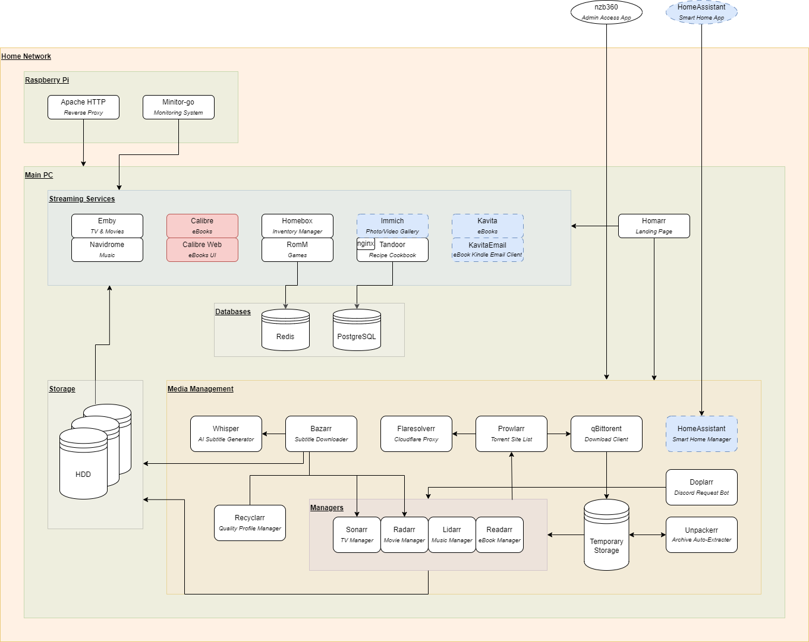

# Architecture Diagram



## Work In Progress

----

## Systems

### Main PC

### Raspberry Pi

### Synology NAS

### Mobile Apps

## Services

TODO: Decide the order of the subheadings within each service

###  Radarr

TODO: Purpose

#### Docker Compose Extract

```yaml
radarr:
  image: linuxserver/radarr:nightly-version-5.7.0.8851
  container_name: radarr
  hostname: radarr
  depends_on:
    qbittorrent:
      condition: service_healthy
  deploy:
    resources:
      limits:
        cpus: "1"
        memory: "1024M"
  environment:
    # Base config
    TZ: "${TIMEZONE:?Timezone not set}"
  healthcheck:
    interval: 30s
    retries: 3
    start_period: 30s
    test: [ "CMD", "wget", "--no-verbose", "--tries=1", "--spider", "http://127.0.0.1:3000/ping" ]
    timeout: 5s
  labels:
    # Reverse proxy config
    traefik.enable: "true"
    traefik.http.routers.radarr.rule: "Host(`radarr.${DOMAIN_NAME}`)"
    traefik.http.routers.radarr.entrypoints: "websecure"
    traefik.http.routers.radarr.tls: "true"
    traefik.http.routers.radarr.middlewares: "authentik@file"
    traefik.http.services.radarr.loadbalancer.server.port: "4000"
    # Uptime-Kuma monitor config
    kuma.{{container_name}}.http.name: "Radarr (Movie Manager)"
    kuma.{{container_name}}.http.url: "${RADARR_MONITOR_URL:?[radarr] Monitor URL missing}"
  networks:
    - home
  ports:
    - "4000:3000"
  restart: unless-stopped
  user: "${PUID_ROOT:?User ID missing}:${PGID_ROOT:?Group ID missing}"
  volumes:
    # Volume mounts from host system
    - "${DOWNLOADS_DIRECTORY}:/downloads"
    - "${MOVIE_DIRECTORY}:/movies"
    # Persistent volumes
    - ./storage/radarr/:/config
```

#### Additional Environment Variables

None.

#### Required Services

#### Is It Mandatory

No.

Radarr is a companion to Sonarr/Lidarr/Readarr, but it is used to finding movies. If you have no need of *ever* wanting movies to be downloaded
automatically, this service can be removed.

It is possible to search for content through Prowlarr directly if a movie is wanted. However, they may potentially need to be manually renamed/moved
after the download is completed.

#### Healthcheck

Radarr exposes a healthcheck endpoint, **/ping**. We configure the h

#### Ports

The default Radarr port of **7878** has been changed in the Radarr UI to **3000**. We then publicly expose it as port **4000**. This is minor
obfuscation, and should not be considered actual security.

#### Volumes

###  Homarr

###  Sonarr

###  Lidarr

###  Readarr

----

## Misc/Common Info

### Common Healthcheck

TODO: Discuss interval/retries/start_period/timeout default values

### Common Environment Variables

Most services may contain the following environment variables:

| Environment Variable Name | Purpose  | Example Value    |
|---------------------------|----------|------------------|
| TZ (or TIMEZONE)          | Timezone | Pacific/Auckland |

Since they are used throughout, we set these values in the `.env` file and pass them in through our docker compose configuration.

#### PGID/PUID

The **PGID** and **PUID** are used to override the group and user ID of the running container process, for permissions and privileges. Most services
currently use the root user and group (**0**), exposed through the environment variables **PGID_ROOT** and **PUID_ROOT**. Some have been tested with
non-root users and will instead use **PGID_NON_ROOT** and **PUID_NON_ROOT**.

```yaml
services:
  service_name:
    image: image_name:tag
  user: "${PUID_NON_ROOT}:${PGID_NON_ROOT}"
```

#### TZ/TIMEZONE

**TZ** or **TIMEZONE** is used to tell the service the running host's timezone, as defined by
the [tz database](https://en.wikipedia.org/wiki/List_of_tz_database_time_zones#List).

----

## Environment Variables File (.env)

TODO: Describe either in detail here, or high-level but with better comments in the .env.template file

----

## Public Access

Access to the services is controlled by an instance of [Apache](https://httpd.apache.org/), being used as a reverse-proxy. This means all requests go
through the Apache web-server and are then forwarded on to the correct internal system. This means we do not need to expose the ports for each service
publicly, as Apache will be able to forward those requests itself.

### Macro Definition

The following macro is used as a template for most of the services:

```bash
<VirtualHost *:80>
    ServerAdmin admin@email.com
    ServerName $server_name.example.com
    ServerAlias $server_name.site.*

    ProxyPass / $protocol://$url/
    ProxyPassReverse / $protocol://$url/

    RewriteEngine on
    RewriteCond %{HTTP:Upgrade} websocket [NC]
    RewriteCond %{HTTP:Connection} upgrade [NC]
    RewriteRule ^/?(.*) "ws://$url/$1" [P,L]

    ProxyPreserveHost on
    ProxyRequests Off
    RemoteIPHeader X-Forwarded-For

    TimeOut 20
    ErrorDocument 502 https://status.example.com
    ErrorDocument 503 https://status.example.com
</VirtualHost>
```

Breaking down the macro, we can define each section/line:

#### VirtualHost

```bash
<VirtualHost *:80>
...
</VirtualHost>
```

Definition

#### Host Configuration

```bash
ServerAdmin admin@email.com
```

Definition

```bash
ServerName $server_name.example.com
```

Definition

```bash
ServerAlias $server_name.site.*
```

Definition

#### URL Proxying

```bash
ProxyPass / $protocol://$url/
```

Definition

```bash
ProxyPassReverse / $protocol://$url/
```

Definition

#### Websocket Enabling

```bash
RewriteEngine on
```

Definition

```bash
RewriteCond %{HTTP:Upgrade} websocket [NC]
```

Definition

```bash
RewriteCond %{HTTP:Connection} upgrade [NC]
```

Definition

```bash
RewriteRule ^/?(.*) "ws://$url/$1" [P,L]
```

Definition

#### Preserving Originating Host

```bash
ProxyPreserveHost on
```

Definition

```bash
ProxyRequests Off
```

Definition

```bash
RemoteIPHeader X-Forwarded-For
```

Definition

#### Timeouts And Errors

```bash
TimeOut 20
```

Definition

```bash
ErrorDocument 502 https://status.example.com
```

Definition

```bash
ErrorDocument 503 https://status.example.com
```

Definition

### Custom Configuration

In addition to the basic configuration, we have extra configuration for (TODO: discuss tandoor, homarr, redirects next)

----

## Authentication

Where possible, we use [Authentik](https://goauthentik.io/) to secure the services.

The following services are integrated with Authentik, and their configuration is below.

TODO:

### Basic Auth

The following services forward username/password information from the Authentik user's group to the service:

- Bazarr
- Lidarr
- Navidrome
- Prowlarr
- Radarr
- Readarr
- Sonarr

### OIDC

The following services allow you to login/create an account using Authentik:

- Homarr
- Linkwarden
- Synology NAS
- Tandoor

### X-Authentik-* Headers

The following services can't be logged in using the local URL, as they require X-Authentik-* headers to be forwarded:

- Dozzle
- Ollama

### No Internal Auth

The following services don't have any authentication of their own (or it is disabled), so Authentik is the only authentication:

- File Browser
- Jellystat
- NetAlertX
- Uptime-Kuma

----

## Backups

TODO: Move all this info into the service-level documentation instead of making it common
TODO: Add description of how we use bind mounts rather than volumes (except for where required), and why

### Creating Backups

#### Scheduled Backups

The following containers have backup systems, which are configured to take weekly backups.
You can either retrieve the latest automated backup, or can export a fresh one.

For the following containers, a new backup can be generated by going to **System**> **Backup**> **Backup Now**.

- `bazarr`
- `lidarr`
- `prowlarr`
- `radarr`
- `readarr`
- `sonarr`

#### Built-In Backups

The following containers have no scheduled backup, but there is an option in the UI to export one:

- `tandoor`

For the `tandoor` container, the backup can be generated by clicking on the toolbox icon in the toolbar, selecting **Export**, selecting the option
**All recipes**, then pressing the **Export** button.

#### Manual Backups

The following containers have no built-in backup systems, and must have their content archived manually.

- `homebox`

For the `homebox` container, there is an import/export feature, but we need to manually back up any uploaded screenshots/PDFs/attachments. This can be
done using the commands:

```bash
docker exec -it homebox sh
root@homebox:/# tar -czf homebox.tar.gz /data/
```

These attachments will unfortunately have to be manually added to each item (as of v0.9.0). In addition, an export of all items must be done by going
to **Tools**> **Import/Export**> **Export Inventory**.

#### No Backups

The following containers have no need for backups, or backups are not used:

- `doplarr`
- `flaresolverr`
- `navidrome`
- `qbittorrent`
- `unpackerr`

For `navidrome`, the music directory is read-only so on creating a new container, you simply need to re-create the admin user. Custom playlists are
lost, but I don't use them, so I don't actually care. Might update this if I use more playlists in the future.

### Retrieving Backups

Once a backup has been created on the container, it should be copied to the host system. This can be done by copying the file from the container.
If you are unsure of where the file is saved, you can connect to the container and search the file system by using the command:

```bash
docker exec -it [CONTAINER_ID] bash
```

Once you know the filepath of the backup file, you can copy it to the host by executing this command from the host itself:

```bash
docker cp [CONTAINER_ID]:/path/to/backup/file.tar.gz ./host/path/to/backup/file.tar.gz
```

### Restoring Backups

TODO:

----

## Logos & Images

TODO: Describe the ./logos directory and where those icons are use. Re-organise the structure while you're at it

----

## Future Plans

New/replaced services
Further auth integrations
Better backup solutions

## Database Upgrades

When upgrading major versions of databases, the existing database needs to be backed up, the container updated, and the backup restored on the new
container. For the following, use `source .env` to ensure the variables are loaded into the terminal.

### Authentik DB

Following instructions from the [Authentik documentation for DB upgrade](https://docs.goauthentik.io/docs/troubleshooting/postgres/upgrade_docker).

Take backup of the current database, then shut the Authentik containers down:

```bash
docker compose exec authentik-db pg_dump -U ${AUTHENTIK_DB_USER} -d ${AUTHENTIK_DB_NAME} -cC > backup_authentik.sql
docker compose -f docker-compose-pi.yml down authentik authentik-worker authentik-cache authentik-db
```

Upgrade the version of [PostgreSQL](https://registry.hub.docker.com/_/postgres) for `authentik-db`.
Next, delete the storage for `authentik-db` (make sure to copy this directory/volume first).

Finally, start up the new DB container, restore the backup, then start the remaining Authentik containers:

```bash
docker compose -f docker-compose-pi.yml up --build -d authentik-db --wait
cat backup_authentik.sql | docker compose exec -T authentik-db psql -U ${AUTHENTIK_DB_USER}
docker compose -f docker-compose-pi.yml up --build -d authentik authentik-worker authentik-cache
```

### Jellystat DB

Take backup of the current database, then shut the Jellystat containers down:

```bash
docker compose exec jellystat-db pg_dump -U ${JELLYSTAT_DB_USER} -d ${JELLYSTAT_DB_NAME} -cC > backup_jellystat.sql
docker compose down jellystat jellystat-db
```

Upgrade the version of [PostgreSQL](https://registry.hub.docker.com/_/postgres) for `jellystat-db`.
Next, delete the storage for `jellystat-db` (make sure to copy this directory/volume first).

Finally, start up the new DB container, restore the backup, then start the remaining Jellystat containers:

```bash
docker compose up --build -d jellystat-db --wait
cat backup_jellystat.sql | docker compose exec -T jellystat-db psql -U ${JELLYSTAT_DB_USER}
docker compose up --build -d jellystat
```

### Linkwarden DB

Take backup of the current database, then shut the Linkwarden containers down:

```bash
docker compose exec linkwarden-db pg_dump -U ${LINKWARDEN_DB_USER} -d ${LINKWARDEN_DB_NAME} -cC > backup_linkwarden.sql
docker compose down linkwarden linkwarden-db
```

Upgrade the version of [PostgreSQL](https://registry.hub.docker.com/_/postgres) for `linkwarden-db`.
Next, delete the storage for `linkwarden-db` (make sure to copy this directory/volume first).

Finally, start up the new DB container, restore the backup, then start the remaining Linkwarden containers:

```bash
docker compose up --build -d linkwarden-db --wait
cat backup_linkwarden.sql | docker compose exec -T linkwarden-db psql -U ${LINKWARDEN_DB_USER}
docker compose up --build -d linkwarden
```

### RomM DB

Take backup of the current database, then shut the RomM containers down:

```bash
docker compose exec romm-db mariadb-dump --all-databases -uroot -p"${ROMM_DB_ROOT_PASSWORD}" > backup_romm.sql
docker compose down romm romm-db
```

Upgrade the version of [MariaDB](https://registry.hub.docker.com/_/mariadb) for `romm-db`.
Next, delete the storage for `romm-db` (make sure to copy this directory/volume first).

Finally, start up the new DB container, restore the backup, then start the remaining RomM containers:

```bash
docker compose up --build -d romm-db --wait
cat backup_romm.sql | docker compose exec romm-db sh -c 'exec mariadb -uroot -p"${ROMM_DB_ROOT_PASSWORD}"'
docker compose up --build -d romm
```

Workaround for Windows, due to input device not being a TTY:

```bash
docker compose up --build -d romm-db
docker cp backup_romm.sql romm-db:/
winpty docker exec -it romm-db bash
exec mariadb -uroot -p"${ROMM_DB_ROOT_PASSWORD}" < /backup_romm.sql
exit
docker compose up --build -d romm
```

### SonarQube DB

Take backup of the current database, then shut the SonarQube containers down:

```bash
docker compose exec sonarqube-db pg_dump -U ${SONARQUBE_DB_USER} -d ${SONARQUBE_DB_NAME} -cC > backup_sonarqube.sql
docker compose down sonarqube sonarqube-db
```

Upgrade the version of [PostgreSQL](https://registry.hub.docker.com/_/postgres) for `sonarqube-db`.
Next, delete the storage for `sonarqube-db` (make sure to copy this directory/volume first).

Finally, start up the new DB container, restore the backup, then start the remaining SonarQube containers:

```bash
docker compose up --build -d sonarqube-db --wait
cat backup_sonarqube.sql | docker compose exec -T sonarqube-db psql -U ${SONARQUBE_DB_USER}
docker compose up --build -d sonarqube
```

### SpeedTest DB

Take backup of the current database, then shut the SpeedTest containers down:

```bash
docker compose exec speedtest-db pg_dump -U ${SPEEDTEST_DB_USER} -d ${SPEEDTEST_DB_NAME} -cC > backup_speedtest.sql
docker compose -f docker-compose-pi.yml down speedtest speedtest-db
```

Upgrade the version of [PostgreSQL](https://registry.hub.docker.com/_/postgres) for `speedtest-db`.
Next, delete the storage for `speedtest-db` (make sure to copy this directory/volume first).

Finally, start up the new DB container, restore the backup, then start the remaining SpeedTest containers:

```bash
docker compose -f docker-compose-pi.yml up --build -d speedtest-db --wait
cat backup_speedtest.sql | docker compose exec -T speedtest-db psql -U ${SPEEDTEST_DB_USER}
docker compose -f docker-compose-pi.yml up --build -d speedtest
```

### Tandoor DB

Take backup of the current database, then shut the Tandoor containers down:

```bash
docker compose exec tandoor-db pg_dump -U ${TANDOOR_DB_USER} -d ${TANDOOR_DB_NAME} -cC > backup_tandoor.sql
docker compose down tandoor tandoor-ui tandoor-db
```

Upgrade the version of [PostgreSQL](https://registry.hub.docker.com/_/postgres) for `tandoor-db`.
Next, delete the storage for `tandoor-db` (make sure to copy this directory/volume first).

Finally, start up the new DB container, restore the backup, then start the remaining Tandoor containers:

```bash
docker compose up --build -d tandoor-db --wait
cat backup_tandoor.sql | docker compose exec -T tandoor-db psql -U ${TANDOOR_DB_USER}
docker compose up --build -d tandoor tandoor-ui
```

## Misc Info

### Authentik

We use our domain [logos](./logos/site) in the container. But because the **/media** directory is also a volume, they can be overridden by the
container being built. After the initial run, once the container is in a **healthy** state, `docker cp` the logos to the
**/media/public/application-icons/** directory in the container.

### Dozzle

In order for Dozzle to connect to another host, the docker socket needs to be exposed over TCP.

#### Linux

For a Linux-based host, first we must find the service:

```shell
systemctl status docker | grep "Loaded:"
```

- Find the path to the service in the output, for example: `/lib/systemd/system/docker.service`
- Edit the service: `sudo systemctl edit docker.service`
- Add the following content to the file in the section above the ignored content:

```conf
[Service]
ExecStart=
ExecStart=/usr/bin/dockerd -H fd:// -H tcp://<lan_ip_address_of_host>:2375 --containerd=/run/containerd/containerd.sock
```

- Reload the daemon: `sudo systemctl daemon-reload`
- Restart the docker service `sudo systemctl restart docker.service`
- Confirm the port is in LISTEN state with the LAN IP address:

```shell
sudo netstat -lntp | grep dockerd
tcp        0      0 <lan_ip_address_of_host>:2375      0.0.0.0:*               LISTEN      1234/dockerd
```

#### Windows

For a Window-based host using Docker Desktop, the following needs to be done:

- Open Docker Desktop
- Navigate to **Settings** > **General**
- Check the box for "Expose daemon on tcp://localhost:2375 without TLS"
- Restart

Next, open a Powershell terminal as admin, and allow binding to 0.0.0.0:

```bash
netsh interface portproxy add v4tov4 listenport=2375 listenaddress=0.0.0.0 connectport=2375 connectaddress=127.0.0.1
```

Confirm this has been applied:

```bash
netsh interface portproxy show v4tov4

Listen on ipv4:             Connect to ipv4:

Address         Port        Address         Port
--------------- ----------  --------------- ----------
0.0.0.0         2375        127.0.0.1       2375
```

Finally, allow inbound connections to this port through the Windows Firewall:

- Open Windows Firewall settings
- Navigate to **Advanced Settings** > **Inbound Rules**
- Add a new rule:
    - Rule Type: Select **Port** as the rule type
    - Protocol and Ports: **TCP** on port **2375**
    - Action: **Allow the connection**
    - Profile: Apply the rule to the appropriate profiles for your machine
    - Name: Any free-text. For example, "Docker TCP"

### Homarr

#### Initial Setup

On initial start, you'll be asked to create an admin user. You won't be able to log in with this user unless you change the following environment
variable:

```yaml
AUTH_PROVIDER: "oidc"
```

To:

```yaml
AUTH_PROVIDER: "credentials,oidc"
```

However, by creating a user in Authentik assigned to the group **HomarrAdmins**, your Authentik user will be logged in as an administrator and able to
configure your Homarr instance. If this group name needs to be changed, update the `AUTH_OIDC_ADMIN_GROUP` environment variable for Homarr to match
the group name in Authentik.

### NetAlertX

#### Initial Setup

The container will create an updated [app.conf](./docker/netalert/config/app.conf) file and save it in the container at **/app.conf.new**. However,
since the container creates a fresh
file on initial install, we cannot simply copy it as part of our [Dockerfile](./docker/netalert/Dockerfile). Instead, when you first run the service,
you must copy it yourself.

Once the first run of NetAlertX shows the container as **healthy**, `docker exec` into the container and run the following commands to replace the
configuration file, and then restart the `netalert` container.

```bash
cp /app/config/app.conf /app/config/app.conf.bak
cp -f /app.conf.new /app/config/app.conf
exit
docker compose -f docker-compose-pi.yml restart netalert
```

**NOTE:** This isn't robust to version upgrades, a fresh installation with new config entries needs to be compared.
An [issue has been raised](https://github.com/jokob-sk/NetAlertX/issues/687), but no ETA on if/when it might be done.

### Ollama

#### Initial Setup

The container first comes up with no users and no models. Neither of these can be set programatically, so on the first start-up some actions must be
performed.

##### Create Admin User

In order to create the admin user, the `ENABLE_SIGNUP` environment variable must be set to **true**. Log in through the URL configured by Authentik,
which will pass the **X-Authentik-Email** header value. This will create an admin account for your email address.

Once created, update `ENABLE_SIGNUP` variable to **false**. Then perform a `docker compose down ollama` and `docker compose up --build -d ollama` to
rebuild the container with the updated value.

##### Download Models

Next the [models](https://ollama.com/library) need to be downloaded. This can be done through the UI itself, or you can `docker exec` into the
container and run the following commands:

```bash
ollama pull llama3.1:8b         # Main model
ollama pull llama2-uncensored   # Older version of the model, but with no filters
```

### RomM

#### Logging

To reduce the amount of nginx logs printed in the docker console, the following update can be done (there is currently no easy way to configure this).

```bash
docker exec -it romm bash
vi /etc/nginx/nginx.conf

# Find the line with 'access_log', and replace with the following:
map $status $loggable
{ 
  ~^[2] 0; 
  default 1; 
}
access_log /dev/stdout romm_log if=$loggable;

# Then exit and restart the container
exit
docker restart romm
```

### SonarQube

#### Initial Setup

When first starting SonarQube, the container may fail to come up with the following error:

```shell
ERROR es[][o.e.b.Elasticsearch] fatal exception while booting Elasticsearch
java.lang.IllegalStateException: Unable to access 'path.data' (/opt/sonarqube/data/es8)
  at org.elasticsearch.bootstrap.FilePermissionUtils.addDirectoryPath(FilePermissionUtils.java:66) ~[elasticsearch-8.14.3.jar:?]
  at org.elasticsearch.bootstrap.Security.addFilePermissions(Security.java:236) ~[elasticsearch-8.14.3.jar:?]
  at org.elasticsearch.bootstrap.Security.createPermissions(Security.java:178) ~[elasticsearch-8.14.3.jar:?]
  at org.elasticsearch.bootstrap.Security.configure(Security.java:125) ~[elasticsearch-8.14.3.jar:?]
  at org.elasticsearch.bootstrap.Elasticsearch.initPhase2(Elasticsearch.java:202) ~[elasticsearch-8.14.3.jar:?]
  at org.elasticsearch.bootstrap.Elasticsearch.main(Elasticsearch.java:74) ~[elasticsearch-8.14.3.jar:?]
Caused by: java.nio.file.AccessDeniedException: /opt/sonarqube/data/es8
```

This can be resolved by stopping the container and running the following command on the mounted directory:

```shell
sudo chown -R "${PUID_NON_ROOT}:${PUID_NON_ROOT}" ./storage/sonarqube
```

There may be a subsequent error on Linux:

```shell
max virtual memory areas vm.max_map_count [65530] is too low
```

This can be resolved by updating the setting on the host machine, by running the following commands:

```shell
sudo vi /etc/sysctl.conf
# Add the following line:
vm.max_map_count=262144
# Exit vi
sudo sysctl --system
```

#### Upgrade

When updating SonarQube, check the logs for a message like the following:

```log
The database must be manually upgraded. Please backup the database and browse /setup. For more information: https://docs.sonarsource.com/sonarqube/latest/setup/upgrading
```

Log in to the `/setup` link and follow the instructions.

### Tandoor

#### Initial Setup

Once installed, go to the Django admin console (**User**> **Admin**), then click on **Sites**. Manually update the *Domain Name* and *Display Name* to
your own domain name. This cannot be configured through environment variables.
