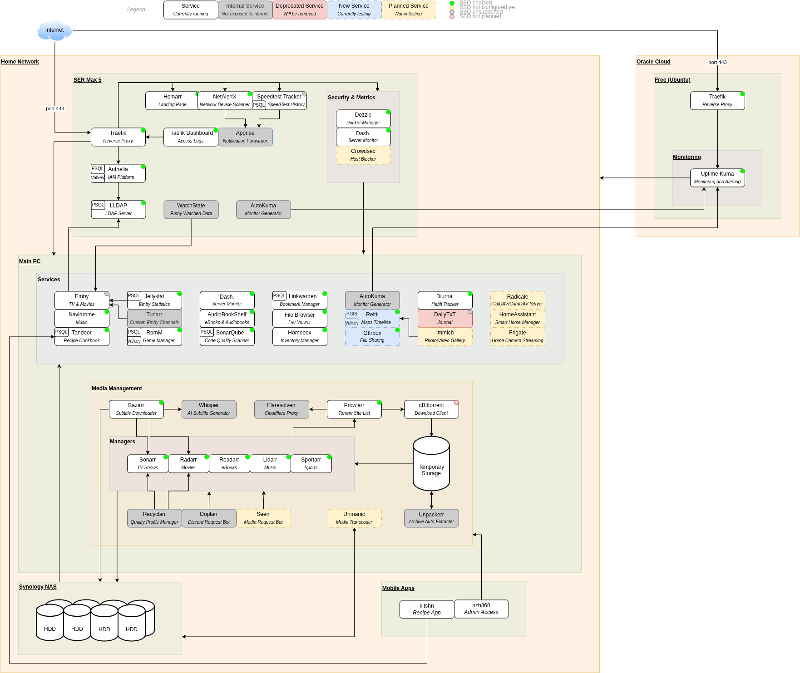

# Architecture Diagram



## Work In Progress

----

## Systems

### Main PC

### SER Max 5

### Raspberry Pi

### Synology NAS

### Mobile Apps

## Authentication

Where possible, we use an IdP ([Authelia](https://www.authelia.com/)) to secure the services.

The following services are integrated with the IdP, and their configuration is below.

TODO:

### Basic Auth

The following services forward username/password information from the user's group in the IdP to the service:

- Dozzle
- Navidrome

### OIDC

The following services allow you to login/create an account using the IdP:

- AudioBookShelf
- Homarr
- Linkwarden
- RomM
- SonarQube
- Tandoor

### No Internal Auth

The following services don't have any authentication of their own (or it is disabled), so the IdP is the only authentication:

- Arrs
    - Bazarr
    - Lidarr
    - Prowlarr
    - Radarr
    - Readarr
    - Sonarr
- File Browser
- Jellystat
- NetAlertX
- Traefik
- Uptime-Kuma

----

## Backups

TODO: Move all this info into the service-level documentation instead of making it common
TODO: Add description of how we use bind mounts rather than volumes (except for where required), and why

### Creating Backups

#### Scheduled Backups

The following containers have backup systems, which are configured to take weekly backups.
You can either retrieve the latest automated backup, or can export a fresh one.

For the following containers, a new backup can be generated by going to **System**> **Backup**> **Backup Now**.

- `bazarr`
- `lidarr`
- `prowlarr`
- `radarr`
- `readarr`
- `sonarr`

#### Built-In Backups

The following containers have no scheduled backup, but there is an option in the UI to export one:

- `tandoor`

For the `tandoor` container, the backup can be generated by clicking on the toolbox icon in the toolbar, selecting **Export**, selecting the option
**All recipes**, then pressing the **Export** button.

#### Manual Backups

The following containers have no built-in backup systems, and must have their content archived manually.

- `homebox`

For the `homebox` container, there is an import/export feature, but we need to manually back up any uploaded screenshots/PDFs/attachments. This can be
done using the commands:

```bash
docker exec -it homebox sh
root@homebox:/# tar -czf homebox.tar.gz /data/
```

These attachments will unfortunately have to be manually added to each item (as of v0.9.0). In addition, an export of all items must be done by going
to **Tools**> **Import/Export**> **Export Inventory**.

#### No Backups

The following containers have no need for backups, or backups are not used:

- `doplarr`
- `flaresolverr`
- `navidrome`
- `qbittorrent`
- `unpackerr`

For `navidrome`, the music directory is read-only so on creating a new container, you simply need to re-create the admin user. Custom playlists are
lost, but I don't use them, so I don't actually care. Might update this if I use more playlists in the future.

### Retrieving Backups

Once a backup has been created on the container, it should be copied to the host system. This can be done by copying the file from the container.
If you are unsure of where the file is saved, you can connect to the container and search the file system by using the command:

```bash
docker exec -it [CONTAINER_ID] bash
```

Once you know the filepath of the backup file, you can copy it to the host by executing this command from the host itself:

```bash
docker cp [CONTAINER_ID]:/path/to/backup/file.tar.gz ./host/path/to/backup/file.tar.gz
```

### Restoring Backups

TODO:

----

## Logos & Images

TODO: Describe the ./logos directory and where those icons are use. Re-organise the structure while you're at it

----

## Future Plans

New/replaced services
Further auth integrations
Better backup solutions

## Database Upgrades

When upgrading major versions of databases, the existing database needs to be backed up, the container updated, and the backup restored on the new
container. For the following, use `source .env` to ensure the variables are loaded into the terminal.

### Authelia DB

Take backup of the current database, then shut the Authelia containers down:

```bash
docker compose -f docker-compose-ser.yml exec authelia-db pg_dump -U ${AUTHELIA_DB_USER} -d ${AUTHELIA_DB_NAME} -cC > backup_authelia.sql
docker compose -f docker-compose-ser.yml down authelia authelia-cache authelia-db
```

Upgrade the version of [PostgreSQL](https://registry.hub.docker.com/_/postgres) for `authelia-db`.
Next, delete the storage for `authelia-db` (make sure to copy this directory/volume first).

Finally, start up the new DB container, restore the backup, then start the remaining Authelia containers:

```bash
docker compose -f docker-compose-ser.yml up --build -d authelia-db --wait
cat backup_authelia.sql | docker compose -f docker-compose-ser.yml exec -T authelia-db psql -U ${AUTHELIA_DB_USER}
docker compose -f docker-compose-ser.yml up --build -d authelia authelia-cache
```

### Jellystat DB

Take backup of the current database, then shut the Jellystat containers down:

```bash
docker compose exec jellystat-db pg_dump -U ${JELLYSTAT_DB_USER} -d ${JELLYSTAT_DB_NAME} -cC > backup_jellystat.sql
docker compose down jellystat jellystat-db
```

Upgrade the version of [PostgreSQL](https://registry.hub.docker.com/_/postgres) for `jellystat-db`.
Next, delete the storage for `jellystat-db` (make sure to copy this directory/volume first).

Finally, start up the new DB container, restore the backup, then start the remaining Jellystat containers:

```bash
docker compose up --build -d jellystat-db --wait
cat backup_jellystat.sql | docker compose exec -T jellystat-db psql -U ${JELLYSTAT_DB_USER}
docker compose up --build -d jellystat
```

### Linkwarden DB

Take backup of the current database, then shut the Linkwarden containers down:

```bash
docker compose exec linkwarden-db pg_dump -U ${LINKWARDEN_DB_USER} -d ${LINKWARDEN_DB_NAME} -cC > backup_linkwarden.sql
docker compose down linkwarden linkwarden-db
```

Upgrade the version of [PostgreSQL](https://registry.hub.docker.com/_/postgres) for `linkwarden-db`.
Next, delete the storage for `linkwarden-db` (make sure to copy this directory/volume first).

Finally, start up the new DB container, restore the backup, then start the remaining Linkwarden containers:

```bash
docker compose up --build -d linkwarden-db --wait
cat backup_linkwarden.sql | docker compose exec -T linkwarden-db psql -U ${LINKWARDEN_DB_USER}
docker compose up --build -d linkwarden
```

### LLDAP DB

Take backup of the current database, then shut the LLDAP containers down:

```bash
docker compose -f docker-compose-ser.yml exec lldap-db pg_dump -U ${LLDAP_DB_USER} -d ${LLDAP_DB_NAME} -cC > backup_lldap.sql
docker compose -f docker-compose-ser.yml down lldap lldap-db
```

Upgrade the version of [PostgreSQL](https://registry.hub.docker.com/_/postgres) for `lldap-db`.
Next, delete the storage for `lldap-db` (make sure to copy this directory/volume first).

Finally, start up the new DB container, restore the backup, then start the remaining LLDAP containers:

```bash
docker compose -f docker-compose-ser.yml up --build -d lldap-db --wait
cat backup_lldap.sql | docker compose -f docker-compose-ser.yml exec -T lldap-db psql -U ${LLDAP_DB_USER}
docker compose -f docker-compose-ser.yml up --build -d lldap
```

### RomM DB

Take backup of the current database, then shut the RomM containers down:

```bash
docker compose exec romm-db pg_dump -U ${ROMM_DB_USER} -d ${ROMM_DB_NAME} -cC > backup_romm.sql
docker compose down romm romm-db romm-cache
```

Upgrade the version of [PostgreSQL](https://registry.hub.docker.com/_/postgres) for `romm-db`.
Next, delete the storage for `romm-db` (make sure to copy this directory/volume first).

Finally, start up the new DB container, restore the backup, then start the remaining RomM containers:

```bash
docker compose up --build -d romm-db --wait
cat backup_romm.sql | docker compose exec -T romm-db psql -U ${ROMM_DB_USER}
docker compose up --build -d romm romm-cache
```

### SonarQube DB

Take backup of the current database, then shut the SonarQube containers down:

```bash
docker compose exec sonarqube-db pg_dump -U ${SONARQUBE_DB_USER} -d ${SONARQUBE_DB_NAME} -cC > backup_sonarqube.sql
docker compose down sonarqube sonarqube-db
```

Upgrade the version of [PostgreSQL](https://registry.hub.docker.com/_/postgres) for `sonarqube-db`.
Next, delete the storage for `sonarqube-db` (make sure to copy this directory/volume first).

Finally, start up the new DB container, restore the backup, then start the remaining SonarQube containers:

```bash
docker compose up --build -d sonarqube-db --wait
cat backup_sonarqube.sql | docker compose exec -T sonarqube-db psql -U ${SONARQUBE_DB_USER}
docker compose up --build -d sonarqube
```

### SpeedTest DB

Take backup of the current database, then shut the SpeedTest containers down:

```bash
docker compose -f docker-compose-ser.yml exec speedtest-db pg_dump -U ${SPEEDTEST_DB_USER} -d ${SPEEDTEST_DB_NAME} -cC > backup_speedtest.sql
docker compose -f docker-compose-ser.yml down speedtest speedtest-db
```

Upgrade the version of [PostgreSQL](https://registry.hub.docker.com/_/postgres) for `speedtest-db`.
Next, delete the storage for `speedtest-db` (make sure to copy this directory/volume first).

Finally, start up the new DB container, restore the backup, then start the remaining SpeedTest containers:

```bash
docker compose -f docker-compose-ser.yml up --build -d speedtest-db --wait
cat backup_speedtest.sql | docker compose -f docker-compose-ser.yml exec -T speedtest-db psql -U ${SPEEDTEST_DB_USER}
docker compose -f docker-compose-ser.yml up --build -d speedtest
```

### Tandoor DB

Take backup of the current database, then shut the Tandoor containers down:

```bash
docker compose exec tandoor-db pg_dump -U ${TANDOOR_DB_USER} -d ${TANDOOR_DB_NAME} -cC > backup_tandoor.sql
docker compose down tandoor tandoor-db
```

Upgrade the version of [PostgreSQL](https://registry.hub.docker.com/_/postgres) for `tandoor-db`.
Next, delete the storage for `tandoor-db` (make sure to copy this directory/volume first).

Finally, start up the new DB container, restore the backup, then start the remaining Tandoor containers:

```bash
docker compose up --build -d tandoor-db --wait
cat backup_tandoor.sql | docker compose exec -T tandoor-db psql -U ${TANDOOR_DB_USER}
docker compose up --build -d tandoor
```

### Combined

#### Host

```shell
# Take backups
docker compose exec jellystat-db pg_dump -U ${JELLYSTAT_DB_USER} -d ${JELLYSTAT_DB_NAME} -cC > backup_jellystat.sql
docker compose exec linkwarden-db pg_dump -U ${LINKWARDEN_DB_USER} -d ${LINKWARDEN_DB_NAME} -cC > backup_linkwarden.sql
docker compose exec romm-db pg_dump -U ${ROMM_DB_USER} -d ${ROMM_DB_NAME} -cC > backup_romm.sql
docker compose exec sonarqube-db pg_dump -U ${SONARQUBE_DB_USER} -d ${SONARQUBE_DB_NAME} -cC > backup_sonarqube.sql
docker compose exec tandoor-db pg_dump -U ${TANDOOR_DB_USER} -d ${TANDOOR_DB_NAME} -cC > backup_tandoor.sql

# Shut down all containers
docker compose down jellystat jellystat-db linkwarden linkwarden-db romm romm-db sonarqube sonarqube-db tandoor tandoor-ui tandoor-db

# Update for new PostgreSQL version
sudo rm -rf ./storage/jellystat-db/ ./storage/linkwarden-db/ ./storage/romm-db/ ./storage/sonarqube-db/ ./storage/tandoor-db/
docker compose pull

# Start DB containers
docker compose up --build -d jellystat-db linkwarden-db romm-db sonarqube-db tandoor-db --wait

# Restore backups
cat backup_jellystat.sql | docker compose exec -T jellystat-db psql -U ${JELLYSTAT_DB_USER}
cat backup_linkwarden.sql | docker compose exec -T linkwarden-db psql -U ${LINKWARDEN_DB_USER}
cat backup_romm.sql | docker compose exec -T romm-db psql -U ${ROMM_DB_USER}
cat backup_sonarqube.sql | docker compose exec -T sonarqube-db psql -U ${SONARQUBE_DB_USER}
cat backup_tandoor.sql | docker compose exec -T tandoor-db psql -U ${TANDOOR_DB_USER}

# Start services
docker compose up --build -d jellystat linkwarden romm sonarqube tandoor tandoor-ui
```

#### SER

```shell
# Take backups
docker compose -f docker-compose-ser.yml exec authelia-db pg_dump -U ${AUTHELIA_DB_USER} -d ${AUTHELIA_DB_NAME} -cC > backup_authelia.sql
docker compose -f docker-compose-ser.yml exec lldap-db pg_dump -U ${LLDAP_DB_USER} -d ${LLDAP_DB_NAME} -cC > backup_lldap.sql
docker compose -f docker-compose-ser.yml exec speedtest-db pg_dump -U ${SPEEDTEST_DB_USER} -d ${SPEEDTEST_DB_NAME} -cC > backup_speedtest.sql

# Shut down all containers
docker compose -f docker-compose-ser.yml down authelia authelia-cache authelia-db lldap lldap-db speedtest speedtest-db

# Update for new PostgreSQL version
sudo rm -rf ./storage/authelia-db/ ./storage/lldap-db/ ./storage/speedtest-db/
docker compose -f docker-compose-ser.yml pull

# Start DB containers
docker compose -f docker-compose-ser.yml up --build -d authelia-db lldap-db speedtest-db --wait

# Restore backups
cat backup_authelia.sql | docker compose -f docker-compose-ser.yml exec -T authelia-db psql -U ${AUTHELIA_DB_USER}
cat backup_lldap.sql | docker compose -f docker-compose-ser.yml exec -T lldap-db psql -U ${LLDAP_DB_USER}
cat backup_speedtest.sql | docker compose -f docker-compose-ser.yml exec -T speedtest-db psql -U ${SPEEDTEST_DB_USER}

# Start services
docker compose -f docker-compose-ser.yml up --build -d authelia authelia-cache lldap speedtest

```

## Misc Info

### Dozzle

In order for Dozzle to connect to another host, the docker socket needs to be exposed over TCP.

#### Linux

For a Linux-based host, first we must find the service:

```shell
systemctl status docker | grep "Loaded:"
```

- Find the path to the service in the output, for example: `/lib/systemd/system/docker.service`
- Edit the service: `sudo systemctl edit docker.service`
- Add the following content to the file in the section above the ignored content:

```conf
[Service]
ExecStart=
ExecStart=/usr/bin/dockerd -H fd:// -H tcp://<lan_ip_address_of_host>:2375 --containerd=/run/containerd/containerd.sock
```

- Reload the daemon: `sudo systemctl daemon-reload`
- Restart the docker service `sudo systemctl restart docker.service`
- Confirm the port is in LISTEN state with the LAN IP address:

```shell
sudo netstat -lntp | grep dockerd
tcp        0      0 <lan_ip_address_of_host>:2375      0.0.0.0:*               LISTEN      1234/dockerd
```

#### Windows

For a Window-based host using Docker Desktop, the following needs to be done:

- Open Docker Desktop
- Navigate to **Settings** > **General**
- Check the box for "Expose daemon on tcp://localhost:2375 without TLS"
- Restart

Next, open a Powershell terminal as admin, and allow binding to 0.0.0.0:

```bash
netsh interface portproxy add v4tov4 listenport=2375 listenaddress=0.0.0.0 connectport=2375 connectaddress=127.0.0.1
```

Confirm this has been applied:

```bash
netsh interface portproxy show v4tov4

Listen on ipv4:             Connect to ipv4:

Address         Port        Address         Port
--------------- ----------  --------------- ----------
0.0.0.0         2375        127.0.0.1       2375
```

Finally, allow inbound connections to this port through the Windows Firewall:

- Open Windows Firewall settings
- Navigate to **Advanced Settings** > **Inbound Rules**
- Add a new rule:
    - Rule Type: Select **Port** as the rule type
    - Protocol and Ports: **TCP** on port **2375**
    - Action: **Allow the connection**
    - Profile: Apply the rule to the appropriate profiles for your machine
    - Name: Any free-text. For example, "Docker TCP"

### Homarr

#### Initial Setup

On initial start, you'll be asked to create an admin user. You won't be able to log in with this user unless you change the following environment
variable:

```yaml
AUTH_PROVIDER: "oidc"
```

To:

```yaml
AUTH_PROVIDER: "credentials,oidc"
```

You will be asked to define a group used by your IdP (like Authelia or Authentik). You can use **homarr_admins** (or another value if wanted), and you
will need to ensure your user has the same role in the IdP.

### NetAlertX

#### Initial Setup

The container will create an updated [app.conf](./docker/netalert/config/app.conf) file and save it in the container at **/app.conf.new**. However,
since the container creates a fresh
file on initial install, we cannot simply copy it as part of our [Dockerfile](./docker/netalert/Dockerfile). Instead, when you first run the service,
you must copy it yourself.

Once the first run of NetAlertX shows the container as **healthy**, `docker exec` into the container and run the following commands to replace the
configuration file, and then restart the `netalert` container.

```bash
cp /app/config/app.conf /app/config/app.conf.bak
cp -f /app.conf.new /app/config/app.conf
exit
docker compose -f docker-compose-ser.yml restart netalert
```

**NOTE:** This isn't robust to version upgrades, a fresh installation with new config entries needs to be compared.
An [issue has been raised](https://github.com/jokob-sk/NetAlertX/issues/687), but no ETA on if/when it might be done.

### RomM

#### Logging

To reduce the amount of nginx logs printed in the docker console, the following update can be done (there is currently no easy way to configure this).

```bash
docker exec -it romm bash
vi /etc/nginx/nginx.conf

# Find the line with 'access_log', and replace with the following:
map $status $loggable
{ 
  ~^[2] 0; 
  default 1; 
}
access_log /dev/stdout romm_log if=$loggable;

# Then exit and restart the container
exit
docker restart romm
```

### SonarQube

#### Initial Setup

When first starting SonarQube, the container may fail to come up with the following error:

```shell
ERROR es[][o.e.b.Elasticsearch] fatal exception while booting Elasticsearch
java.lang.IllegalStateException: Unable to access 'path.data' (/opt/sonarqube/data/es8)
  at org.elasticsearch.bootstrap.FilePermissionUtils.addDirectoryPath(FilePermissionUtils.java:66) ~[elasticsearch-8.14.3.jar:?]
  at org.elasticsearch.bootstrap.Security.addFilePermissions(Security.java:236) ~[elasticsearch-8.14.3.jar:?]
  at org.elasticsearch.bootstrap.Security.createPermissions(Security.java:178) ~[elasticsearch-8.14.3.jar:?]
  at org.elasticsearch.bootstrap.Security.configure(Security.java:125) ~[elasticsearch-8.14.3.jar:?]
  at org.elasticsearch.bootstrap.Elasticsearch.initPhase2(Elasticsearch.java:202) ~[elasticsearch-8.14.3.jar:?]
  at org.elasticsearch.bootstrap.Elasticsearch.main(Elasticsearch.java:74) ~[elasticsearch-8.14.3.jar:?]
Caused by: java.nio.file.AccessDeniedException: /opt/sonarqube/data/es8
```

This can be resolved by stopping the container and running the following command on the mounted directory:

```shell
sudo chown -R "${PUID_NON_ROOT}:${PUID_NON_ROOT}" ./storage/sonarqube
```

There may be a subsequent error on Linux:

```shell
max virtual memory areas vm.max_map_count [65530] is too low
```

This can be resolved by updating the setting on the host machine, by running the following commands:

```shell
sudo vi /etc/sysctl.conf
# Add the following line:
vm.max_map_count=262144
# Exit vi
sudo sysctl --system
```

##### OIDC Authentication

The [sonar-auth-oidc](https://github.com/sonar-auth-oidc/sonar-auth-oidc) plugin is used to enable OIDC support. To install the plugin:

- Download the latest JAR file
- Copy the JAR to the container

```shell
docker cp sonar-auth-oidc-plugin-3.0.0.jar sonarqube:/opt/sonarqube/extensions/plugins
```

- Restart the container

```shell
docker restart sonarqube
```

By default users logging in using OIDC will be assigned to the `sonar-users` group (built-in to SonarQube). In order to create an administrator,
ensure they are added to the `sonar_admins` group in your IdP (the name of the admin group can be changed at
<https://sonarqube.example.com/admin/groups>).

#### Admin Authentication

If OIDC authentication fails, you can force SonarQube to allow you to use admin credentials by going to this link:
**<https://sonarqube.example.com/?auto-login=false>**

If the admin password needs to be reset, the following commands can reset it to `admin`:

```shell
dockerexec sonarqube-db
psql

update users set crypted_password='100000$t2h8AtNs1AlCHuLobDjHQTn9XppwTIx88UjqUm4s8RsfTuXQHSd/fpFexAnewwPsO6jGFQUv/24DnO55hY6Xew==',
salt='k9x9eN127/3e/hf38iNiKwVfaVk=',
hash_method='PBKDF2',
reset_password='true',
user_local='true'
where login='admin';

exit
exit
```

#### Upgrade

When updating SonarQube, check the logs for a message like the following:

```log
The database must be manually upgraded. Please backup the database and browse /setup. For more information: https://docs.sonarsource.com/sonarqube/latest/setup/upgrading
```

Log in to the `/setup` link and follow the instructions.

### Tandoor

#### Initial Setup

Once installed, go to the Django admin console (**User**> **Admin**), then click on **Sites**. Manually update the *Domain Name* and *Display Name* to
your own domain name. This cannot be configured through environment variables.
