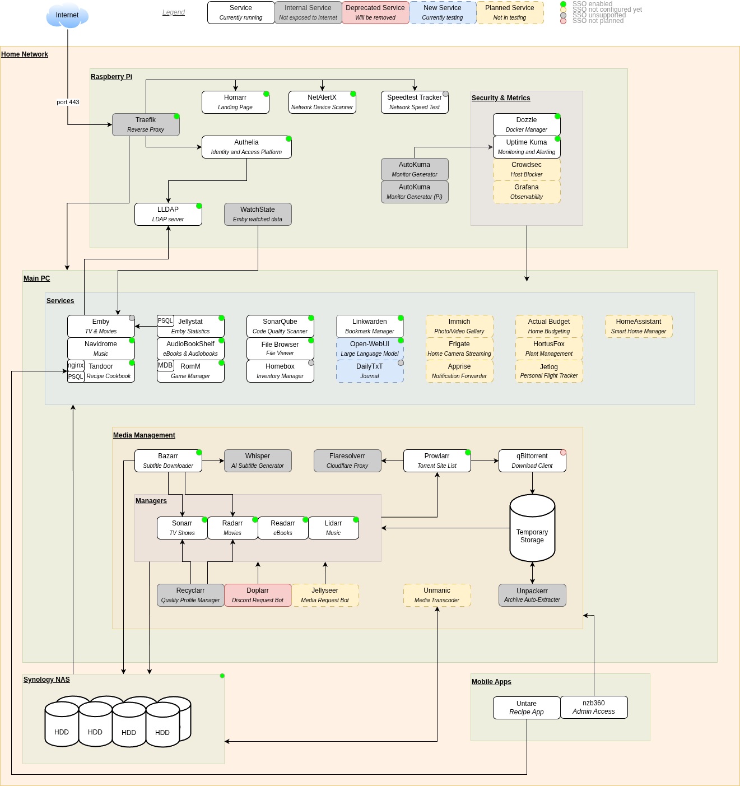

# Architecture Diagram



# Backups

## Creating Backups

### Scheduled Backups

The following containers have backup systems which are configured to take weekly backups.
You can either retrieve the latest automated backup, or can export a fresh one.

For the following containers, a new backup can be generated by going to **System**> **Backup**> **Backup Now**.

- `bazarr`
- `lidarr`
- `prowlarr`
- `radarr`
- `readarr`
- `sonarr`

### Built-In Backups

The following containers have no scheduled backup, but there is an option in the UI to export one:

- `calibre`
- `tandoor`

For the `calibre` container, the backup can be generated by going to the toolbar and selecting **\[LIBRARY_NAME\]**> **Export/import all calibre data
**> **Export all your calibre data**> **Select all libraries**.

For the `tandoor` container, the backup can be generated by clicking on the toolbox icon in the toolbar, selecting **Export**, selecting the option
**All recipes**, then pressing the **Export** button.

### Manual Backups

The following containers have no built-in backup systems, and must have their content archived manually.

- `calibre-web-1`
- `calibre-web-2`
- `homebox`

For the `calibre-web` containers, a new backup can be generated by connecting to the container and manually archiving the `/config` directory, using
the commands:

```
docker exec -it calibre-web-1 bash
root@calibre-web-1:/# tar -czf calibre-web-1.tar.gz /config/

docker exec -it calibre-web-2 bash
root@calibre-web-2:/# tar -czf calibre-web-2.tar.gz /config/
```

For the `homebox` container, there is an import/export feature, but we need to manually back up any uploaded screenshots/PDFs/attachments. This can be
done using the commands:

```
docker exec -it homebox sh
root@homebox:/# tar -czf homebox.tar.gz /data/
```

These attachments will unfortunately have to be manually added to each item (as of v0.9.0). In addition, an export of all items must be done by going
to **Tools**> **Import/Export**> **Export Inventory**.

### No Backups

The following containers have no need for backups, or backups are not used:

- `doplarr`
- `flaresolverr`
- `navidrome`
- `qbittorrent`
- `unpackerr`

For `navidrome`, the music directory is read-only so on creating a new container, you simply need to re-create the admin user. Custom playlists are
lost, but I don't use them, so I don't really care. Might update this if I use more playlists in the future.

## Retrieving Backups

Once a backup has been created on the container, it should be copied to the host system. This can be done by copying the file from the container.
If you are unsure of where the file is saved, you can connect to the container and search the file system by using the command:

```
docker exec -it [CONTAINER_ID] bash
```

Once you know the filepath of the backup file, you can copy it to the host by executing this command from the host itself:

```
docker cp [CONTAINER_ID]:/path/to/backup/file.tar.gz ./host/path/to/backup/file.tar.gz
```

## Restoring Backups

TBC